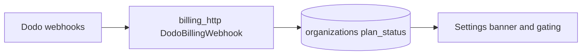

# Subscription lifecycle (Dodo) — merged plan

## References

- **Skill:** [`.agents/skills/subscription-integration/SKILL.md`](.agents/skills/subscription-integration/SKILL.md) (trials, upgrades/downgrades, `on_payment_failure`, webhooks).
- **Backend billing:** [`apps/server/main-server/internal/services/billing/billing_service.go`](apps/server/main-server/internal/services/billing/billing_service.go), [`billing_http.go`](apps/server/main-server/internal/server/billing_http.go), [`dodo_error.go`](apps/server/main-server/internal/services/billing/dodo_error.go).
- **Settings UI:** [`apps/app/app/workspace/settings/page.tsx`](apps/app/app/workspace/settings/page.tsx).

## Proration modes (Dodo) vs MantrixFlow

Your Step 5 table matches Dodo’s API. In code today:

| Concern | Current behavior |
|---------|------------------|
| **Upgrades** | Prefer **fair billing**: `proration_billing_mode: "prorated_immediately"` with `on_payment_failure: "prevent_change"` when `effective_at` is immediate (see `ChangeSubscriptionPlan`). |
| **Downgrades** | `on_payment_failure: "apply_change"`; **`effective_at: "next_billing_date"`** forces **`proration_billing_mode: "full_immediately"`** (Dodo 422 `INVALID_PRORATION_MODE_WITH_NEXT_BILLING_DATE` otherwise). |
| **Other modes** | `difference_immediately`, `do_not_bill`, etc. are available in the API but not exposed as user toggles; add only if product needs them. |

## Plan changes (already implemented)

- **Live subscription preflight** before change plan (avoids inactive-subscription 422s).
- **409** / user-facing codes for scheduled cancellation and similar (`MapDodoAPIError`).
- **Preview change plan** route exists; response should be extended with **`immediate_charge.line_items`** for Stripe/Cursor-style confirm copy (see todos below).
- **Cancel scheduled change**, **update payment method**, **ConfirmationModal** for destructive billing actions on settings.

## Dunning and recovery (partially aligned with Step 5)

Your snippet uses **`payment.failed`** and **`subscription.active`** (restore access). In [`billing_http.go`](apps/server/main-server/internal/server/billing_http.go):

- **`subscription.on_hold`** → `handleSubOnHold` sets **`plan_status` = `past_due`** (not a literal `"on_hold"` enum in DB).
- **`payment.failed`** → `handlePaymentFailed` sets **`past_due`** if org was `active`.
- **`payment.succeeded`** → `handlePaymentSucceeded` clears **`past_due`** back to **`active`**.
- UI treats **`past_due` and `on_hold`** in subscription payload for banners (Dodo-enriched status).

**Gap vs Step 5 “grace period then downgrade to free”:** there is **no scheduled job** after N days on `payment.failed`; only status + Dodo retries/customer emails on their side. If product wants auto-downgrade, add a worker/cron keyed off `plan_status` + `payment_failed_at` (new column) or webhook idempotency table.

**Optional doc/parity:** either persist Dodo **`on_hold`** explicitly in `plan_status` or document that **`past_due` means on-hold** for gating — avoid duplicate meanings in new code.

## Webhook coverage checklist

Ensure handler registry includes events you rely on for lifecycle (per skill + Dodo docs): subscription created/updated/active, plan changed, renewed, cancelled, on hold, expired, **payment.succeeded**, **payment.failed**. Extend only when a new product action depends on an event.

## Remaining implementation todos (product-facing)

1. **Preview line items for upgrades** — Extend [`BillingPreviewChangePlan`](apps/server/main-server/internal/server/billing_http.go) / preview service to return **`immediate_charge.line_items`** (and totals) from Dodo preview; add TS types and **ConfirmationModal** breakdown before `changePlan` on upgrade.
2. **Preview parity for scheduled downgrades** — When calling preview with **`effective_at: "next_billing_date"`**, apply the same **`full_immediately`** override as `ChangeSubscriptionPlan` in [`PreviewChangePlan`](apps/server/main-server/internal/services/billing/billing_service.go) so preview matches charge behavior.
3. **Optional** — Grace-period downgrade job + schema if involuntary churn policy requires it.
4. **Optional** — Expose additional `proration_billing_mode` values in API only if PM specifies; default matrix above stays.
