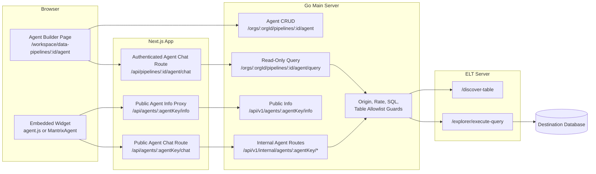
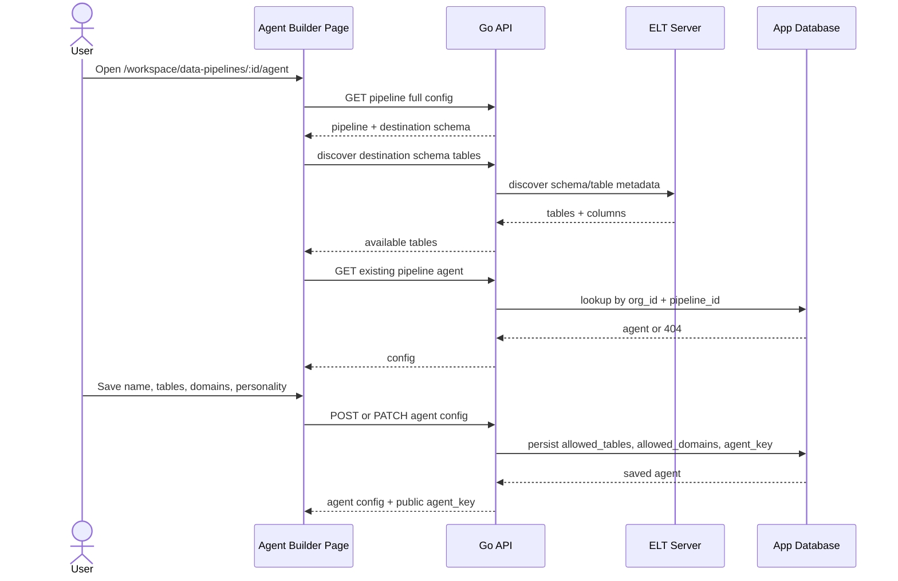
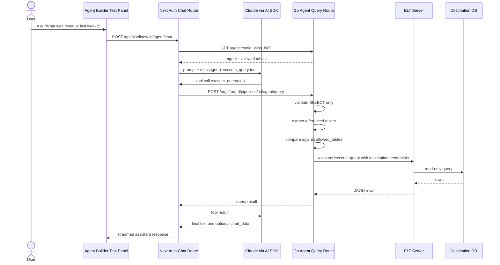
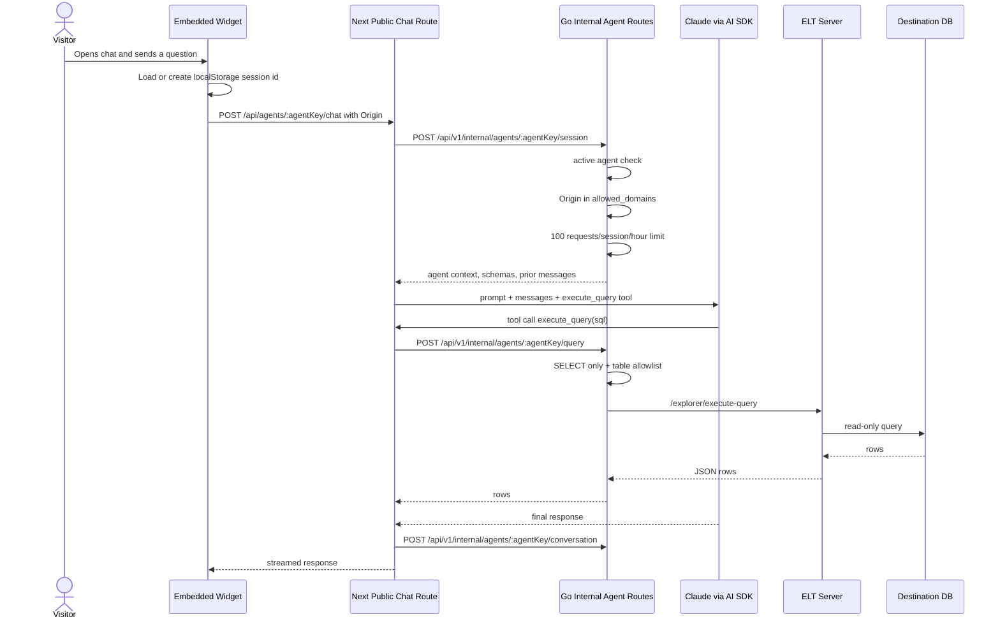
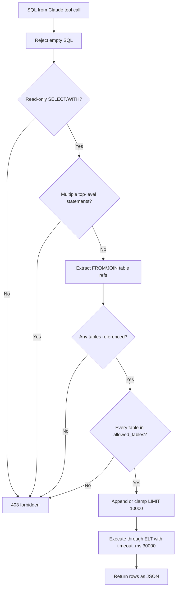

# Agent Flow Charts

## End-to-End Architecture

```mermaid
flowchart LR
  subgraph Browser
    Builder["Agent Builder Page\n/workspace/data-pipelines/:id/agent"]
    Widget["Embedded Widget\nagent.js or MantrixAgent"]
  end

  subgraph Next["Next.js App"]
    BuilderChat["Authenticated Agent Chat Route\n/api/pipelines/:id/agent/chat"]
    PublicChat["Public Agent Chat Route\n/api/agents/:agentKey/chat"]
    PublicInfo["Public Agent Info Proxy\n/api/agents/:agentKey/info"]
  end

  subgraph Go["Go Main Server"]
    CRUD["Agent CRUD\n/orgs/:orgId/pipelines/:id/agent"]
    Query["Read-Only Query\n/orgs/:orgId/pipelines/:id/agent/query"]
    Internal["Internal Agent Routes\n/api/v1/internal/agents/:agentKey/*"]
    Info["Public Info\n/api/v1/agents/:agentKey/info"]
    Guards["Origin, Rate, SQL,\nTable Allowlist Guards"]
  end

  subgraph ELT["ELT Server"]
    Discover["/discover-table"]
    Execute["/explorer/execute-query"]
  end

  DB[("Destination Database")]

  Builder --> CRUD
  Builder --> BuilderChat
  BuilderChat --> Query
  Widget --> PublicInfo
  PublicInfo --> Info
  Widget --> PublicChat
  PublicChat --> Internal
  Internal --> Guards
  Query --> Guards
  Guards --> Discover
  Guards --> Execute
  Execute --> DB
```

## Agent Configuration Flow

```mermaid
sequenceDiagram
  actor User
  participant Page as Agent Builder Page
  participant Go as Go API
  participant ELT as ELT Server
  participant DB as App Database

  User->>Page: Open /workspace/data-pipelines/:id/agent
  Page->>Go: GET pipeline full config
  Go-->>Page: pipeline + destination schema
  Page->>Go: discover destination schema tables
  Go->>ELT: discover schema/table metadata
  ELT-->>Go: tables + columns
  Go-->>Page: available tables
  Page->>Go: GET existing pipeline agent
  Go->>DB: lookup by org_id + pipeline_id
  DB-->>Go: agent or 404
  Go-->>Page: config
  User->>Page: Save name, tables, domains, personality
  Page->>Go: POST or PATCH agent config
  Go->>DB: persist allowed_tables, allowed_domains, agent_key
  DB-->>Go: saved agent
  Go-->>Page: agent config + public agent_key
```

## Builder Test Chat Flow

```mermaid
sequenceDiagram
  actor User
  participant Page as Agent Builder Test Panel
  participant Next as Next Auth Chat Route
  participant Claude as Claude via AI SDK
  participant Go as Go Agent Query Route
  participant ELT as ELT Server
  participant Dest as Destination DB

  User->>Page: Ask "What was revenue last week?"
  Page->>Next: POST /api/pipelines/:id/agent/chat
  Next->>Go: GET agent config using JWT
  Go-->>Next: agent + allowed tables
  Next->>Claude: prompt + messages + execute_query tool
  Claude->>Next: tool call execute_query(sql)
  Next->>Go: POST /orgs/:orgId/pipelines/:id/agent/query
  Go->>Go: validate SELECT only
  Go->>Go: extract referenced tables
  Go->>Go: compare against allowed_tables
  Go->>ELT: /explorer/execute-query with destination credentials
  ELT->>Dest: read-only query
  Dest-->>ELT: rows
  ELT-->>Go: JSON rows
  Go-->>Next: query result
  Next->>Claude: tool result
  Claude-->>Next: final text and optional chart_data
  Next-->>Page: streamed assistant response
```

## Public Embed Chat Flow

```mermaid
sequenceDiagram
  actor Visitor
  participant Widget as Embedded Widget
  participant Next as Next Public Chat Route
  participant Go as Go Internal Agent Routes
  participant Claude as Claude via AI SDK
  participant ELT as ELT Server
  participant Dest as Destination DB

  Visitor->>Widget: Opens chat and sends a question
  Widget->>Widget: Load or create localStorage session id
  Widget->>Next: POST /api/agents/:agentKey/chat with Origin
  Next->>Go: POST /api/v1/internal/agents/:agentKey/session
  Go->>Go: active agent check
  Go->>Go: Origin in allowed_domains
  Go->>Go: 100 requests/session/hour limit
  Go-->>Next: agent context, schemas, prior messages
  Next->>Claude: prompt + messages + execute_query tool
  Claude->>Next: tool call execute_query(sql)
  Next->>Go: POST /api/v1/internal/agents/:agentKey/query
  Go->>Go: SELECT only + table allowlist
  Go->>ELT: /explorer/execute-query
  ELT->>Dest: read-only query
  Dest-->>ELT: rows
  ELT-->>Go: JSON rows
  Go-->>Next: rows
  Claude-->>Next: final response
  Next->>Go: POST /api/v1/internal/agents/:agentKey/conversation
  Next-->>Widget: streamed response
```

## Query Guard Flow

```mermaid
flowchart TD
  Start["SQL from Claude tool call"] --> One["Reject empty SQL"]
  One --> Two{"Read-only SELECT/WITH?"}
  Two -- No --> Reject["403 forbidden"]
  Two -- Yes --> Three{"Multiple top-level statements?"}
  Three -- Yes --> Reject
  Three -- No --> Four["Extract FROM/JOIN table refs"]
  Four --> Five{"Any tables referenced?"}
  Five -- No --> Reject
  Five -- Yes --> Six{"Every table in allowed_tables?"}
  Six -- No --> Reject
  Six -- Yes --> Seven["Append or clamp LIMIT 10000"]
  Seven --> Eight["Execute through ELT with timeout_ms 30000"]
  Eight --> Done["Return rows as JSON"]
```

