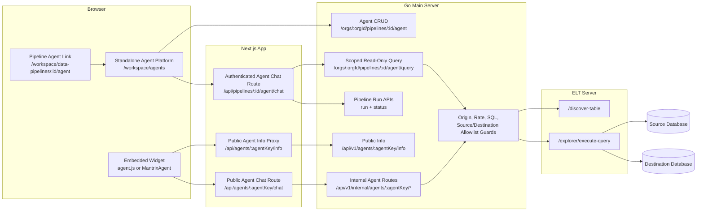
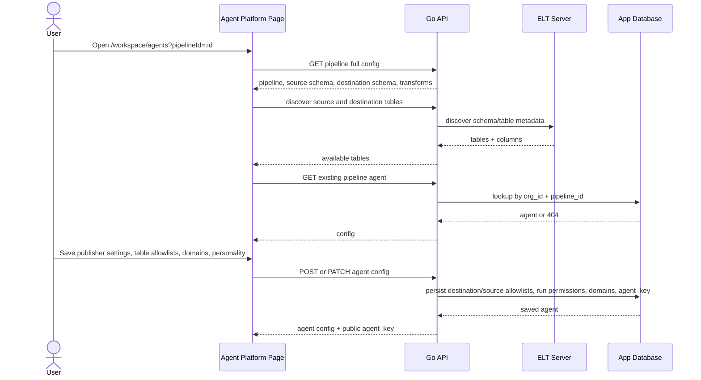
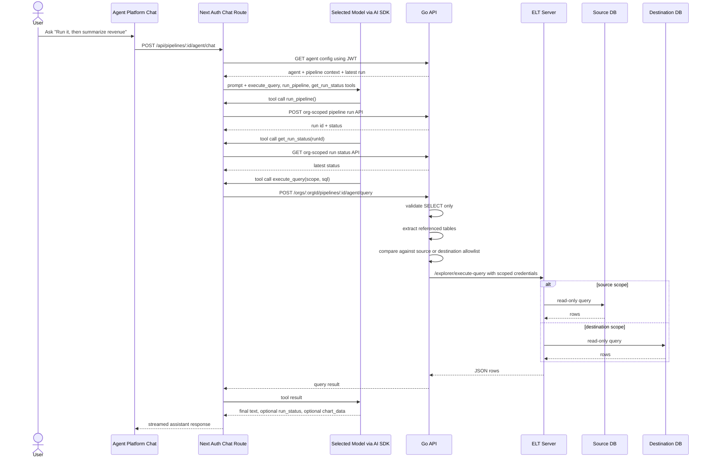
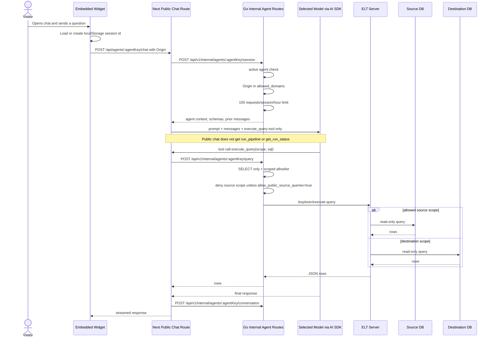
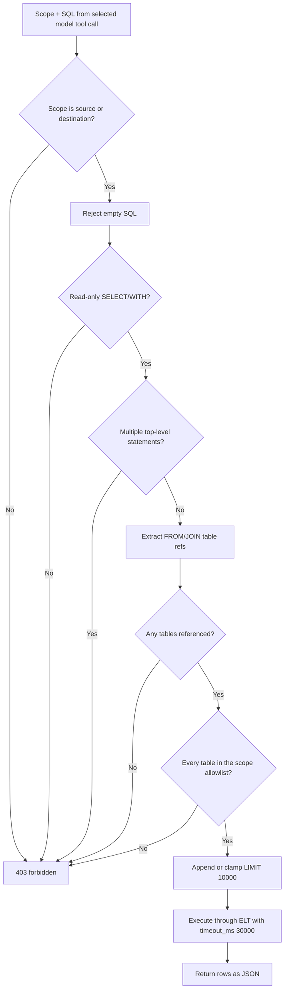

# Agent Flow Charts

## End-to-End Architecture

```mermaid
flowchart LR
  subgraph Browser
    Platform["Standalone Agent Platform\n/workspace/agents"]
    DeepLink["Pipeline Agent Link\n/workspace/data-pipelines/:id/agent"]
    Widget["Embedded Widget\nagent.js or MantrixAgent"]
  end

  subgraph Next["Next.js App"]
    AuthChat["Authenticated Agent Chat Route\n/api/pipelines/:id/agent/chat"]
    PublicChat["Public Agent Chat Route\n/api/agents/:agentKey/chat"]
    PublicInfo["Public Agent Info Proxy\n/api/agents/:agentKey/info"]
  end

  subgraph Go["Go Main Server"]
    CRUD["Agent CRUD\n/orgs/:orgId/pipelines/:id/agent"]
    Query["Scoped Read-Only Query\n/orgs/:orgId/pipelines/:id/agent/query"]
    Runs["Pipeline Run APIs\nrun + status"]
    Internal["Internal Agent Routes\n/api/v1/internal/agents/:agentKey/*"]
    Info["Public Info\n/api/v1/agents/:agentKey/info"]
    Guards["Origin, Rate, SQL,\nSource/Destination Allowlist Guards"]
  end

  subgraph ELT["ELT Server"]
    Discover["/discover-table"]
    Execute["/explorer/execute-query"]
  end

  SourceDB[("Source Database")]
  DestDB[("Destination Database")]

  DeepLink --> Platform
  Platform --> CRUD
  Platform --> AuthChat
  AuthChat --> Query
  AuthChat --> Runs
  Widget --> PublicInfo
  PublicInfo --> Info
  Widget --> PublicChat
  PublicChat --> Internal
  Internal --> Guards
  Query --> Guards
  Guards --> Discover
  Guards --> Execute
  Execute --> SourceDB
  Execute --> DestDB
```

## Agent Configuration Flow

```mermaid
sequenceDiagram
  actor User
  participant Page as Agent Platform Page
  participant Go as Go API
  participant ELT as ELT Server
  participant DB as App Database

  User->>Page: Open /workspace/agents?pipelineId=:id
  Page->>Go: GET pipeline full config
  Go-->>Page: pipeline, source schema, destination schema, transforms
  Page->>Go: discover source and destination tables
  Go->>ELT: discover schema/table metadata
  ELT-->>Go: tables + columns
  Go-->>Page: available tables
  Page->>Go: GET existing pipeline agent
  Go->>DB: lookup by org_id + pipeline_id
  DB-->>Go: agent or 404
  Go-->>Page: config
  User->>Page: Save publisher settings, table allowlists, domains, personality
  Page->>Go: POST or PATCH agent config
  Go->>DB: persist destination/source allowlists, run permissions, domains, agent_key
  DB-->>Go: saved agent
  Go-->>Page: agent config + public agent_key
```

## Authenticated Worker Chat Flow

```mermaid
sequenceDiagram
  actor User
  participant Page as Agent Platform Chat
  participant Next as Next Auth Chat Route
  participant Model as Selected Model via AI SDK
  participant Go as Go API
  participant ELT as ELT Server
  participant Source as Source DB
  participant Dest as Destination DB

  User->>Page: Ask "Run it, then summarize revenue"
  Page->>Next: POST /api/pipelines/:id/agent/chat
  Next->>Go: GET agent config using JWT
  Go-->>Next: agent + pipeline context + latest run
  Next->>Model: prompt + execute_query, run_pipeline, get_run_status tools
  Model->>Next: tool call run_pipeline()
  Next->>Go: POST org-scoped pipeline run API
  Go-->>Next: run id + status
  Model->>Next: tool call get_run_status(runId)
  Next->>Go: GET org-scoped run status API
  Go-->>Next: latest status
  Model->>Next: tool call execute_query(scope, sql)
  Next->>Go: POST /orgs/:orgId/pipelines/:id/agent/query
  Go->>Go: validate SELECT only
  Go->>Go: extract referenced tables
  Go->>Go: compare against source or destination allowlist
  Go->>ELT: /explorer/execute-query with scoped credentials
  alt source scope
    ELT->>Source: read-only query
    Source-->>ELT: rows
  else destination scope
    ELT->>Dest: read-only query
    Dest-->>ELT: rows
  end
  ELT-->>Go: JSON rows
  Go-->>Next: query result
  Next->>Model: tool result
  Model-->>Next: final text, optional run_status, optional chart_data
  Next-->>Page: streamed assistant response
```

## Public Embed Chat Flow

```mermaid
sequenceDiagram
  actor Visitor
  participant Widget as Embedded Widget
  participant Next as Next Public Chat Route
  participant Go as Go Internal Agent Routes
  participant Model as Selected Model via AI SDK
  participant ELT as ELT Server
  participant Source as Source DB
  participant Dest as Destination DB

  Visitor->>Widget: Opens chat and sends a question
  Widget->>Widget: Load or create localStorage session id
  Widget->>Next: POST /api/agents/:agentKey/chat with Origin
  Next->>Go: POST /api/v1/internal/agents/:agentKey/session
  Go->>Go: active agent check
  Go->>Go: Origin in allowed_domains
  Go->>Go: 100 requests/session/hour limit
  Go-->>Next: agent context, schemas, prior messages
  Next->>Model: prompt + messages + execute_query tool only
  Note over Next,Model: Public chat does not get run_pipeline or get_run_status
  Model->>Next: tool call execute_query(scope, sql)
  Next->>Go: POST /api/v1/internal/agents/:agentKey/query
  Go->>Go: SELECT only + scoped allowlist
  Go->>Go: deny source scope unless allow_public_source_queries=true
  Go->>ELT: /explorer/execute-query
  alt allowed source scope
    ELT->>Source: read-only query
    Source-->>ELT: rows
  else destination scope
    ELT->>Dest: read-only query
    Dest-->>ELT: rows
  end
  ELT-->>Go: JSON rows
  Go-->>Next: rows
  Model-->>Next: final response
  Next->>Go: POST /api/v1/internal/agents/:agentKey/conversation
  Next-->>Widget: streamed response
```

## Query Guard Flow

```mermaid
flowchart TD
  Start["Scope + SQL from selected model tool call"] --> Scope{"Scope is source or destination?"}
  Scope -- No --> Reject["403 forbidden"]
  Scope -- Yes --> One["Reject empty SQL"]
  One --> Two{"Read-only SELECT/WITH?"}
  Two -- No --> Reject["403 forbidden"]
  Two -- Yes --> Three{"Multiple top-level statements?"}
  Three -- Yes --> Reject
  Three -- No --> Four["Extract FROM/JOIN table refs"]
  Four --> Five{"Any tables referenced?"}
  Five -- No --> Reject
  Five -- Yes --> Six{"Every table in the scope allowlist?"}
  Six -- No --> Reject
  Six -- Yes --> Seven["Append or clamp LIMIT 10000"]
  Seven --> Eight["Execute through ELT with timeout_ms 30000"]
  Eight --> Done["Return rows as JSON"]
```
