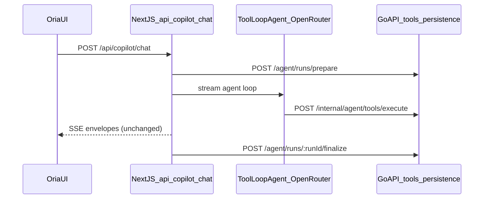

# ADK → Vercel AI SDK migration

This document records the migration of Oria LLM orchestration from Google ADK (Go) to Vercel AI SDK v7 with OpenRouter on Next.js, while Go remains the tool execution and persistence layer.

## Architecture (after migration)

## Removed ADK files (Go)

| Path | Purpose (removed) |
| --- | --- |
| `internal/agents/runtime.go` | ADK runner bootstrap |
| `internal/agents/tree.go` | ADK agent tree |
| `internal/agents/tree_release2.go` … `tree_release6.go` | Release 2–6 ADK trees |
| `internal/agents/authoritative_routing.go` | Keyword/SQL intent routing |
| `internal/agents/direct_responses.go` | Deterministic mock responses |
| `internal/agents/deterministic_*.go` | Deterministic formatters |
| `internal/agents/openrouter/` | Go OpenRouter ADK model adapter |
| `internal/agents/sessionstore/` | ADK Postgres session service |
| `internal/agents/threadcontext/` | ADK thread trimming |
| `internal/server/agent_chat_http.go` | Go SSE chat orchestration |
| `internal/server/agent_tool_adk_shim.go` | ADK ToolExecutor shim |

`google.golang.org/adk/v2` and `google.golang.org/genai` were removed from `go.mod`.

## Kept in Go

- Agent registry (`internal/agents/registry*.go`) — tool allowlists, export source
- Action guard / plans (`internal/agents/actionguard`, `actionplans`)
- All tool executors (`internal/server/agent_*`)
- Thread/message/activity/action HTTP routes
- New endpoints:
  - `POST /api/v1/internal/agent/tools/execute`
  - `POST /api/v1/organizations/:orgId/agent/runs/prepare`
  - `POST /api/v1/organizations/:orgId/agent/runs/:runId/finalize`
- Legacy `POST …/agent/chat` returns **410 Gone** (use Next.js `/api/copilot/chat`)

## New Next.js modules

| Module | Role |
| --- | --- |
| `features/ai-copilot/server/run-oria-chat-stream.ts` | Chat SSE handler |
| `features/ai-copilot/server/agent/openrouter.ts` | OpenRouter provider + tier models |
| `features/ai-copilot/server/agent/orchestrator.ts` | Root + specialist `ToolLoopAgent` loops |
| `features/ai-copilot/server/agent/tools/build-tool-set.ts` | AI SDK tools → Go execute |
| `features/ai-copilot/server/agent/registry/` | Exported prompts/tools JSON |
| `features/ai-copilot/server/agent/sse-envelope.ts` | Go-compatible SSE emitter |
| `features/ai-copilot/server/agent/loop-guard.ts` | Step/transfer/tool budgets |
| `features/ai-copilot/server/agent/run-lifecycle.ts` | Prepare/finalize via Go API |
| `app/api/copilot/chat/route.ts` | Calls `runOriaChatStream()` |

Routing is **model-driven** via `transfer_to_specialist` — no keyword tables or deterministic LLM bypass.

## Environment split

| Concern | Location |
| --- | --- |
| `OPENROUTER_*`, loop limits | `apps/app` server env (Vercel / `.env.local`) |
| `INTERNAL_TOKEN` | Both Next.js (tool bridge) and Go API |
| Release flags, action guard, tool gating | Go `AGENT_*` config |

See [`oria-agent-setup.md`](./agent-setup.md) for operator setup.

## Test results

| Area | Result | Notes |
| --- | --- | --- |
| Go build | Pass | `go build ./...` |
| Go tests | Pass | `go test ./internal/agents/... ./internal/server/...` |
| TypeScript | Pass | `bun run typecheck` in `apps/app` |
| Registry export | Pass | `go run ./cmd/export-oria-registry` → 72 specialists |
| Browser Release 1–6 | Pending operator | Requires live OpenRouter key + signed-in session; see [`oria-browser-ui-test-log.md`](./browser-ui-test-log.md) |

Keyword routing tests were removed from `internal/agents/*_test.go` because routing is now LLM-owned in Next.js.

## Remaining follow-ups

1. Run full browser regression with OpenRouter credits per [`oria-agent-testing-guide.md`](./agent-testing-guide.md).
2. Remove obsolete OpenRouter model vars from Go `.env` if still present (Go no longer calls OpenRouter).
3. Optional: persist `agent.transferred` SSE events from Next.js orchestrator for activity drawer parity.
4. Optional: redact assistant stream text through `secret-redactor.ts` on every delta (currently on finalize validation in Go).

## Changed files summary

**Go:** `state.go`, `main.go`, `routes.go`, `agent_run_tool_http.go`, `agent_run_shared.go`, `agent_chat_stub.go`, action handlers (ActionGuard on State), deleted ADK tree/runtime files.

**Next.js:** `app/api/copilot/chat/route.ts`, new `features/ai-copilot/server/agent/**`, `@openrouter/ai-sdk-provider` dependency, `.env.production.example`.

**Docs:** this file, `oria-agent-setup.md`, `ai-copilot-phase-1.md`, `md-docs/README.md`.
