# MANTrixFlow Source-to-Destination ELT Flow

This is the canonical guide for the current MANTrixFlow product flow.

It describes the real saved contract and runtime behavior across:

- `apps/app`
- `apps/server/main-server`
- `apps/server/elt-server`

## Product overview

MANTrixFlow is ELT-only.

The active product shape is:

- one source node
- one or more destination nodes
- direct source-to-destination edges
- DuckDB-staged ELT only
- destination-owned sync mode and replication key
- destination-owned normalisation rules
- UI-authored SQL dbt models only

The active rules are:

- sync modes are only `FULL_TABLE` and `INCREMENTAL`
- replication key is manual entry on each destination
- `normalisation_rules` live on destination nodes
- `dbt_config.mode` is always `ui_sql`
- Python transform scripts are not part of the active product
- GitHub dbt projects are not part of the active product
- CDC is not part of the active product
- `_dlt_*` metadata must not remain in the client destination

## Canonical delivery contract

Every destination node owns the final delivery contract.

Destination node fields:

- `dest_schema`
- `replication_method`
- `replication_key`
- `normalisation_rules`
- `dbt_config`

Each SQL model inside `dbt_config.sql_models[]` keeps:

- `source_table`
- `output_table`
- `destination_table`
- `sql`

Meaning:

- `output_table` is the internal dbt/DuckDB model name
- `destination_table` is the final client table name
- final client target is `dest_schema.destination_table`

Example:

- source table: `public.company_role_combined`
- internal DuckDB/dbt model: `dim_company_role_combined`
- final client target: `public.users`

Example SQL:

```sql
SELECT
    id,
    company_name AS name
FROM {{ source('raw', 'company_role_combined') }}
```

Saved model:

```json
{
  "source_table": "company_role_combined",
  "output_table": "dim_company_role_combined",
  "destination_table": "users",
  "sql": "SELECT id, company_name AS name FROM {{ source('raw', 'company_role_combined') }}"
}
```

Final target:

```text
public.users
```

## Active support matrix

### Active end-to-end source connectors

- `postgres`
- `mysql`
- `mariadb`
- `mssql`
- `oracle`
- `sqlite`
- `cockroachdb`
- `stripe`
- `shopify`
- `hubspot`
- `notion`
- `github`

### Active end-to-end destination connectors

- `postgres`
- `mysql`
- `mariadb`
- `mssql`
- `oracle`
- `sqlite`
- `cockroachdb`

### Internal-only runtime pieces

- `duckdb` is used internally for staging and dbt execution
- it is not the user-facing destination target in the normal product flow

## End-to-end architecture

```mermaid
flowchart LR
  A["Source connection"] --> B["Source preview + table selection"]
  B --> C["Destination config"]
  C --> D["Go API dispatch"]
  D --> E["Queue worker"]
  E --> F["ELT server"]
  F --> G["DuckDB staging"]
  G --> H["Destination normalisation"]
  H --> I["dbt model build"]
  I --> J["Deliver to final client schema/table"]
  J --> K["Callback + run details"]
```



## Service responsibilities

### App builder

The app saves the graph and destination metadata.

The source node owns:

- source connection
- `selected_streams`
- `stream_configs`
- active raw preview table

Each destination node owns:

- destination connection
- `dest_schema`
- `replication_method`
- `replication_key`
- `normalisation_rules`
- `dbt_config.sql_models[]`
- schedule fields

### Go API

The Go API is responsible for:

- loading and normalizing saved graph data
- preserving destination-owned sync settings and normalisation
- building ELT payloads from destination-node data
- creating `delivery_table_map`
- proxying preview and SQL validation
- receiving ELT callbacks
- persisting run metadata and delivery outputs

### Queue worker

The worker is responsible for:

- checking ELT disk capacity before dispatch
- dispatching the targeted destination run
- preserving retry and backoff behavior

### ELT server

The ELT server is responsible for:

- staging into DuckDB
- applying destination-scoped normalisation
- generating temporary dbt projects from UI SQL
- running dbt inside DuckDB
- delivering `output_table -> dest_schema.destination_table`
- cleaning `_dlt_*` artifacts from the client destination
- extracting checkpoint state and returning callback metadata

## Builder guide

### 1. Configure the source

Open the source drawer from the source node.

Use it to:

- confirm the source connection
- test the connection
- refresh discovery
- select one or more source tables
- choose the active preview table
- inspect raw sample rows

Important behavior:

- one source can include multiple tables
- preview uses one active table at a time
- selected tables persist in `selected_streams`
- per-stream details persist in `stream_configs`

### 2. Add destinations

Use the `+` action on the source node to add destination nodes.

Each destination is independent and can have its own:

- destination connection
- final schema
- sync mode
- replication key
- normalisation rules
- SQL models
- schedule

### 3. Configure destination sync behavior

In the destination `Config` tab set:

- destination connection
- final delivery schema
- sync mode
- manual replication key
- write mode

Rules:

- `FULL_TABLE` does not require a replication key
- `INCREMENTAL` requires a non-empty replication key
- sync mode is destination-owned, not source-owned

### 4. Add destination normalisation

Use the `Normalisation` tab for structural rules only.

Supported rule types:

- `rename`
- `cast`

These rules run during staging for that destination.

Use SQL models, not normalisation rules, for:

- business filtering
- joins
- reshaping across tables
- selecting the final destination columns

### 5. Write UI SQL dbt models

In the destination dbt tab, create one or more models.

For each model define:

- the source table
- the internal dbt model name in `output_table`
- the final client table name in `destination_table`
- the SQL itself

The UI shows both identities:

- internal model: DuckDB/dbt object name
- final target: `dest_schema.destination_table`

### 6. Validate SQL

`Validate SQL` checks the SQL against an in-memory DuckDB schema.

It should:

- succeed without touching the live source database
- return output column names and types
- return exact DuckDB errors for invalid SQL

### 7. Preview model output

`Preview output` runs a small ELT preview for the chosen destination model.

It stages a small sample, applies normalisation, runs the SQL model, and
returns:

- `rows`
- `columns`
- optional `warning`

Empty results are valid preview responses.

### 8. Save and run

Saving the pipeline persists the graph.

A destination run uses the targeted destination node as the source of truth for:

- sync mode
- replication key
- normalisation rules
- SQL models
- final delivery targets

## Runtime phases

### Phase 1: Stage

The ELT server:

- restores checkpoint state when the destination is incremental
- extracts source data
- stages it into an ephemeral DuckDB file
- applies destination-scoped normalisation rules

### Phase 2: dbt Transform

The ELT server:

- generates a temporary dbt project from the saved UI SQL
- materializes each `output_table` inside DuckDB
- optionally runs dbt tests

### Phase 3: Deliver

The ELT server delivers:

- from DuckDB table `output_table`
- to final client target `dest_schema.destination_table`

The final target mapping comes from destination-node ELT data, not from the
legacy relational destination row.

### Phase 4: Cleanup and callback

The ELT server:

- extracts final checkpoint state
- deletes the DuckDB file
- deletes the temporary workspace
- posts callback metadata to the Go API

## Run details and callback metadata

The user-facing run phases are:

- `Stage`
- `dbt Transform`
- `Deliver`

Important callback metadata includes:

- `execution_mode`
- `staging_backend`
- `staging_size_bytes`
- `cleanup_status`
- `dbt_run_status`
- `dbt_models_run`
- `dbt_tests_run`
- `dbt_tests_passed`
- `dbt_tests_failed`
- `delivery_status`
- `delivery_outputs`
- `delivery_failures`

`delivery_outputs` should reflect final client targets such as:

- `public.users`
- `analytics.fct_orders`

## Invariants

These rules should always stay true:

- only `FULL_TABLE` and `INCREMENTAL` are active sync modes
- the runtime path is always DuckDB-staged ELT
- `output_table` stays internal to DuckDB/dbt
- `destination_table` is the final client table
- final delivery target is always `dest_schema.destination_table`
- destination-node data is the active source of truth
- legacy relational destination-table fields are mirrors only
- `_dlt_*` metadata must not remain in the client destination
