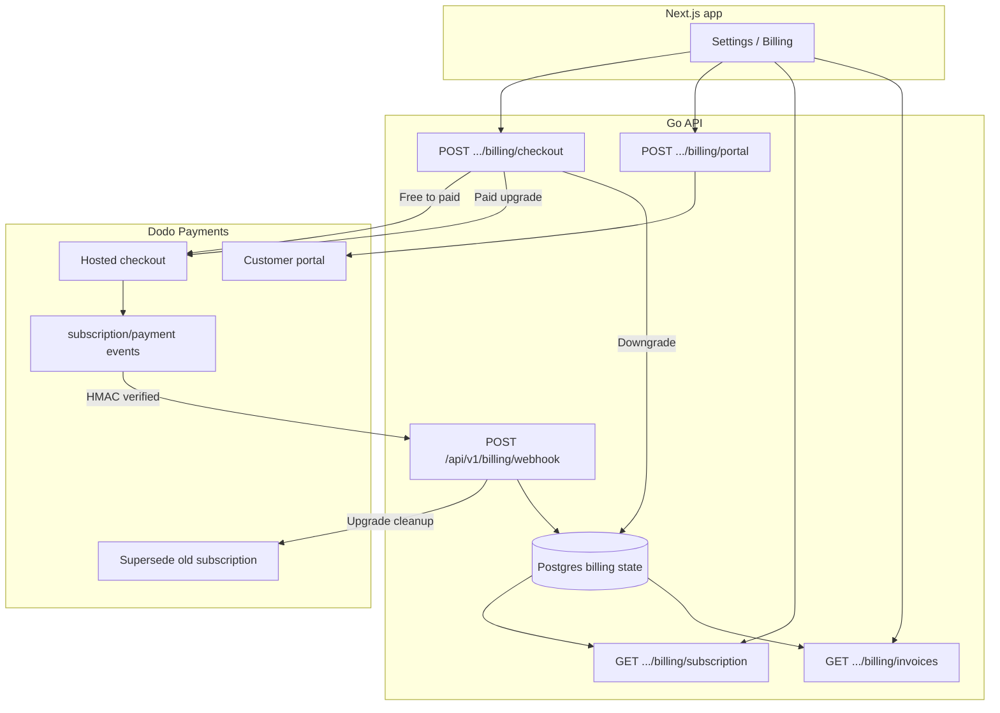
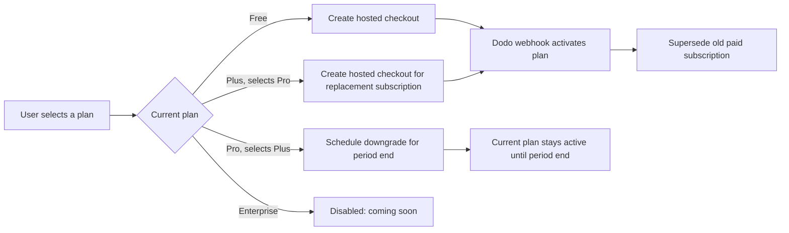

# Dodo Payments and MantrixFlow Flow Charts

Visual map of how Dodo Payments connects to the MantrixFlow stack. The current architecture is documented in [`billing-dodo-billingsdk.md`](./billing-dodo-billingsdk.md).

## Facts This Diagram Reflects

- The Next.js app talks only to the Go API for billing.
- Free to paid uses Dodo hosted checkout.
- Paid upgrades use Dodo hosted checkout for a replacement subscription, then webhook reconciliation supersedes the old subscription.
- Downgrades are scheduled for the next billing cycle.
- The Dodo portal is used for payment methods and hosted receipts.
- Webhooks reconcile the database and are the billing source of truth.

## End-to-End System View

## Checkout Decision

## Quick Reference

| Scenario | Mechanism | When organization plan changes |
| --- | --- | --- |
| Free to Plus/Pro | Hosted checkout | After Dodo success webhook |
| Plus to Pro | Hosted checkout replacement subscription | After Dodo success webhook; old subscription is superseded |
| Pro to Plus | Local scheduled downgrade | At next billing cycle |
| Payment method or invoice view | Dodo customer portal | No plan change unless Dodo emits a lifecycle event |
