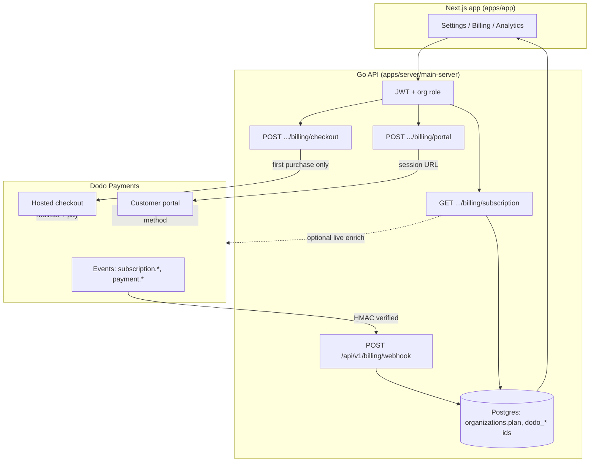
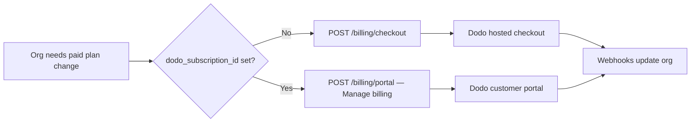
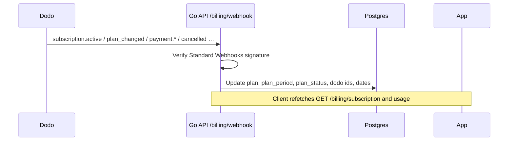

# Dodo Payments × MantrixFlow — flow charts

Visual map of how **Dodo Payments** connects to the MantrixFlow stack. Setup, env vars, and portal-only plan changes are documented in [`dodo-payments-setup.md`](./dodo-payments-setup.md).

**Facts this diagram reflects**

- The **Next.js app** (`apps/app`) talks only to the **Go API** for billing—never to Dodo directly for authenticated flows.
- **First paid purchase:** `POST …/billing/checkout` → Dodo **hosted checkout**.
- **Existing subscription:** plan / interval changes happen in the **customer portal** (`POST …/billing/portal`). The app does **not** use Dodo’s subscription change-plan API.
- **Source of truth** for `organizations.plan` (and related fields) after Dodo events: **webhooks** (`POST /api/v1/billing/webhook`) plus optional reconciliation when the app calls `GET …/billing/subscription`.

---

## End-to-end (system view)

---

## Checkout vs portal

---

## Webhook reconciliation (sequence)

---

## Quick reference

| Path | Mechanism | When plan row updates in DB |
|------|-----------|------------------------------|
| First subscription | Checkout session → pay on Dodo | After webhooks (and GET subscription may enrich) |
| Upgrade / downgrade / monthly ↔ annual | Customer portal only | After user confirms in Dodo → webhooks |
| Payment method, invoices | Portal | Profile in Dodo; org plan unchanged unless an event fires |
