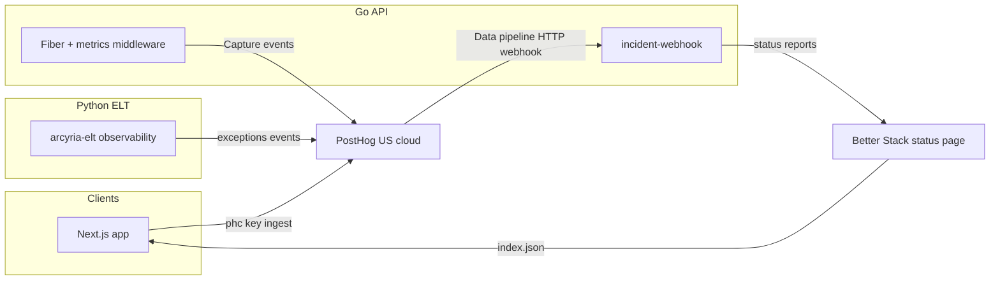

# PostHog + Better Stack full integration (MantrixFlow)

This document describes how MantrixFlow uses **PostHog (free tier)** for product analytics, error tracking, session replay, feature flags, surveys, and web analytics, and **Better Stack (free tier)** for the public status page at [status.mantrixflow.com](https://status.mantrixflow.com).

Setup UI steps remain in:

- [`posthog-setup.md`](./posthog-setup.md)
- [`betterstack-setup.md`](./betterstack-setup.md)
- [`observability-deployment.md`](./deployment.md)

---

## Architecture



| Surface | PostHog | Better Stack |
| --- | --- | --- |
| Next.js app | Page/navigation events, identify, custom events, Web Vitals, replay, heatmaps, flags, surveys, errors | Footer `StatusIndicator` polls public JSON |
| Go API | `api_request` (10% sample), pipeline events, session-linked 5xx `$exception` | Webhook relay only |
| Python ELT | `elt_api_request` (configurable sample), `$exception`, ELT lifecycle events | Optional resource tag `service:arcyria-elt` |

---

## Free-tier coverage and quota budget

The code uses the PostHog products that apply directly to the application runtime. Current monthly free allowances are 1M analytics events, 5K replay recordings, 1M feature-flag requests (experiments use the same allowance), 100K exceptions, and 1,500 survey responses. A free workspace has one project and one-year retention. Verify current limits on the [PostHog pricing page](https://posthog.com/pricing) before changing sampling.

| Capability | Status | Runtime behavior |
| --- | --- | --- |
| Product + web analytics | Enabled | History-aware pageviews/pageleaves, autocapture, typed lifecycle events |
| Heatmaps, rage clicks, dead clicks | Enabled | Browser SDK capture; sensitive DOM text and attributes are masked |
| Web Vitals | Enabled | LCP, CLS, FCP, and INP plus replay network timing |
| Session replay | Enabled | All inputs and all text masked; headers and bodies are not recorded |
| Error tracking | Enabled | Browser, Next server, Go API, and ELT; credential-shaped values are scrubbed |
| Feature flags + experiments | Ready | Browser hook supports boolean flags, variants, and payloads |
| Surveys | Ready | Site apps enabled; surveys are created and targeted in PostHog |
| AI observability | Not enabled | Prompts, SQL, and model output may contain customer data; enable only with a separate redaction design |
| Data warehouse, pipelines, workflows, logs | UI/infrastructure opt-in | These require external PostHog connections and are not application SDK features |

Group analytics is a paid capability. Organization segmentation on the free plan therefore uses identified-person properties (`organization_id`, `organization_slug`) rather than relying on PostHog groups.

| Source | Est. events/mo |
| --- | ---: |
| `$pageview` | ~50K |
| `$pageleave`, Web Vitals, interaction diagnostics | ~60K |
| `api_request` (10% sampled) | ~150K |
| `elt_api_request` (10% sampled) | ~25K |
| Go + app custom events | ~80K |
| identify/person updates | ~25K |
| **Estimated analytics total** | **~390K** |

Exceptions, session replay, feature flags/experiments, and surveys use their own product allowances.

To reduce volume: lower `apiMetricsSampleRate` in `metrics_middleware.go`, set ELT `POSTHOG_API_SAMPLE_RATE`, or add PostHog internal/test-user filters.

---

## Events catalog

### Next.js (`apps/arcyria-platform`)

| Event | When |
| --- | --- |
| `$pageview` / `$pageleave` | Initial load and Next.js history changes |
| `$web_vitals` | Browser performance (LCP, CLS, FCP, INP) |
| `$autocapture`, `$rageclick`, `$dead_click` | Interaction and UX diagnostics |
| `$exception` | Autocapture + `error.tsx` / `global-error.tsx` |
| `pipeline_created` / `pipeline_updated` | Successful create/update mutation |
| `pipeline_run_triggered` | Run from pipeline page or destination node |
| `pipeline_opened` | Loaded pipeline operations screen |
| `connection_created` | New connection saved |
| `data_source_discovered` | Source schema discover |
| `copilot_opened` / `copilot_response_cancelled` | AI copilot interaction |

Helpers: [`apps/arcyria-platform/lib/posthog/events.ts`](../../../apps/arcyria-platform/lib/posthog/events.ts).

Identity: [`PostHogIdentify`](../../../apps/arcyria-platform/shared/providers/posthog-identify.tsx) in the workspace shell uses the stable auth user ID, sets organization person properties for free-plan segmentation, and resets identity on logout. Browser tracing headers carry the distinct, session, and window IDs to the Go API so server errors can be opened with the matching replay.

### Go API (`apps/server/arcyria-server`)

| Event | When |
| --- | --- |
| `api_request` | Every request, **10% sampled** (`MetricsMiddleware`) |
| `pipeline_dispatched` | ELT `RunSync` accepted |
| `pipeline_dispatch_failed` | Dispatch dead-letter |
| `pipeline_dispatch_waiting_disk` | Disk guard re-queue |
| `pipeline_run_started` / `pipeline_run_queued` | HTTP run |
| `pipeline_run_completed` / `pipeline_run_failed` / `pipeline_run_interrupted` | ELT callback |
| `connection_test_succeeded` / `connection_test_failed` | Test-connection handlers |
| `$exception` | 5xx (`ErrorMiddleware`) |

Package entry: [`internal/observability/posthog.go`](../../../apps/server/arcyria-server/internal/observability/posthog.go).

### Python ELT (`apps/server/arcyria-elt`)

| Event | When |
| --- | --- |
| `elt_api_request` | Non-health HTTP request, sampled by `POSTHOG_API_SAMPLE_RATE` |
| `elt_run_started` | ELT accepts a SQL or SaaS run |
| `elt_run_succeeded` / `elt_run_partial` / `elt_run_failed` | ELT finishes before its Go callback |
| `$exception` | Unhandled API exception or scrubbed pipeline failure |

ELT lifecycle names are intentionally distinct from Go API lifecycle names so funnels do not double-count one run.

### Better Stack relay

PostHog `$exception` → `POST /api/v1/internal/incident-webhook` → Better Stack status report.

Improvements in [`incident_webhook.go`](../../../apps/server/arcyria-server/internal/server/incident_webhook.go):

- **Dedup:** same resource within 5 minutes → skip new report
- **Resolve:** updates open report via `AddStatusUpdate` instead of always creating
- **Severity:** `degraded` vs `downtime` from alert title/tags

---

## Feature flags

1. Create flags in PostHog UI (e.g. `new_pipeline_builder`).
2. In app code:

```tsx
import { useFeatureFlag } from "@/hooks/use-feature-flag";

const { enabled } = useFeatureFlag("new_pipeline_builder");
```

Hook: [`apps/arcyria-platform/hooks/use-feature-flag.ts`](../../../apps/arcyria-platform/hooks/use-feature-flag.ts). PostHog experiments use these same flag evaluations; no second SDK is required.

---

## Surveys

`opt_in_site_apps: true` in [`apps/arcyria-platform/lib/posthog/client.ts`](../../../apps/arcyria-platform/lib/posthog/client.ts).

Create surveys in PostHog UI → **Surveys**. Example targeting: users with `pipeline_run_triggered` count ≥ 3 (NPS after successful pipeline usage).

---

## Web analytics

Enable **Web analytics** in PostHog project settings. MantrixFlow already sends `$pageview`; the PostHog dashboard adds sessions, referrers, UTM, devices, and geography automatically.

---

## Suggested dashboards (PostHog UI)

1. **API health** — trend `api_request` and `elt_api_request`, breakdown `status_code`, p95 `duration_ms`
2. **Pipeline funnel** — `pipeline_opened` → `pipeline_run_triggered` → `pipeline_run_completed`
3. **Errors by service** — `$exception` filtered by `service`
4. **Connection quality** — `connection_test_failed` vs succeeded
5. **Org activity** — unique users broken down by person property `organization_id`
6. **UX quality** — Web Vitals plus rage/dead clicks, linked to masked replays

---

## Production deployment checklist

> **Archived infrastructure details:** The SSM, CDK, and ECS steps below describe
> the previous deployment. Use the current
> [OVHcloud deployment guide](../../deployment/infrastructure/ovh-microsandbox-runbook.md) to inject the
> same runtime environment variables.

1. Write SSM parameters (see [`observability-deployment.md`](./deployment.md)):
   - `POSTHOG_API_KEY`, `POSTHOG_HOST`
   - `BETTERSTACK_*` (5 vars on API)
2. Redeploy the API and ELT services using the current infrastructure workflow
3. Vercel: `NEXT_PUBLIC_POSTHOG_KEY`, `NEXT_PUBLIC_POSTHOG_HOST`, `NEXT_PUBLIC_POSTHOG_API_HOST=/ingest`, and `NEXT_PUBLIC_POSTHOG_UI_HOST`
4. PostHog Data pipeline webhook: token = `CALLBACK_TOKEN` (see [`posthog-setup.md`](./posthog-setup.md) Step 7)
5. Smoke: Activity shows `$pageview`; test webhook returns **200**

---

## Troubleshooting

| Symptom | Fix |
| --- | --- |
| No Go events in PostHog | `POSTHOG_API_KEY` missing in ECS task env |
| Webhook 401 | `X-Internal-Token` must match `CALLBACK_TOKEN` / `INTERNAL_TOKEN` |
| Status page unchanged | `BETTERSTACK_*` not in SSM or wrong resource IDs |
| Events without `distinct_id` | User not logged in; check `PostHogIdentify` in workspace |
| Server error has no replay | Confirm the three `X-PostHog-*` headers pass browser CORS |
| Quota warning | Lower API/ELT sample rates; filter internal users in PostHog |

---

## Code map

| Layer | Path |
| --- | --- |
| Next provider | `apps/arcyria-platform/shared/providers/posthog-provider.tsx` |
| Browser startup | `apps/arcyria-platform/instrumentation-client.ts` |
| Client config | `apps/arcyria-platform/lib/posthog/client.ts` |
| Server errors | `apps/arcyria-platform/instrumentation.ts` |
| Go PostHog | `apps/server/arcyria-server/internal/observability/` |
| ELT PostHog | `apps/server/arcyria-elt/core/observability.py` |
| Better Stack client | `apps/server/arcyria-server/internal/betterstack/client.go` |
| Webhook relay | `apps/server/arcyria-server/internal/server/incident_webhook.go` |
| Current infrastructure | `md-docs/deployment/infrastructure/ovh-microsandbox-runbook.md` |
