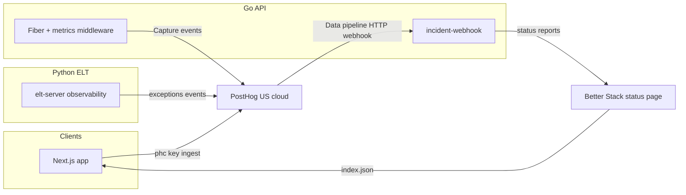

# PostHog + Better Stack full integration (MantrixFlow)

This document describes how MantrixFlow uses **PostHog (free tier)** for product analytics, error tracking, session replay, feature flags, surveys, and web analytics, and **Better Stack (free tier)** for the public status page at [status.mantrixflow.com](https://status.mantrixflow.com).

Setup UI steps remain in:

- [`posthog-setup.md`](./posthog-setup.md)
- [`betterstack-setup.md`](./betterstack-setup.md)
- [`observability-deployment.md`](./observability-deployment.md)

---

## Architecture



| Surface | PostHog | Better Stack |
| --- | --- | --- |
| Next.js app | `$pageview`, identify, group, custom events, replay, flags, surveys | Footer `StatusIndicator` polls public JSON |
| Go API | `api_request` (10% sample), pipeline events, 5xx `$exception` | Webhook relay only |
| Python ELT | `$exception`, pipeline events | Optional resource tag `service:elt-server` |

---

## Free-tier quota budget (~1M analytics events/month)

| Source | Est. events/mo |
| --- | ---: |
| `$pageview` | ~50K |
| Client/server `$exception` | ~10K |
| `api_request` (10% sampled) | ~150K |
| Go + app custom events | ~80K |
| identify/group | ~25K |
| **Total** | **~315K** |

Separate quotas: session replay (5K sessions), feature flags (1M evals), surveys (250 responses).

To reduce volume: lower `apiMetricsSampleRate` in `metrics_middleware.go` or add PostHog internal-user filters.

---

## Events catalog

### Next.js (`apps/app`)

| Event | When |
| --- | --- |
| `$pageview` | Route change (`PostHogPageView`) |
| `$exception` | Autocapture + `error.tsx` / `global-error.tsx` |
| `pipeline_created` / `pipeline_updated` | Builder save (toolbar) |
| `pipeline_run_triggered` | Run from pipeline page or destination node |
| `pipeline_builder_opened` | Builder page mount |
| `connection_created` | New connection saved |
| `data_source_discovered` | Source schema discover |
| `destination_table_mapped` | Destination panel save |

Helpers: [`apps/app/lib/posthog/events.ts`](../apps/app/lib/posthog/events.ts).

Identity: [`PostHogIdentify`](../apps/app/components/providers/posthog-identify.tsx) in workspace layout — `identify(user.id)`, `group('organization', orgId)`, `reset()` on logout.

### Go API (`apps/server/main-server`)

| Event | When |
| --- | --- |
| `api_request` | Every request, **10% sampled** (`MetricsMiddleware`) |
| `pipeline_dispatched` | ELT `RunSync` accepted |
| `pipeline_dispatch_failed` | Dispatch dead-letter |
| `pipeline_dispatch_waiting_disk` | Disk guard re-queue |
| `pipeline_run_started` / `pipeline_run_queued` | HTTP run |
| `pipeline_run_completed` / `pipeline_run_failed` / `pipeline_run_interrupted` | ELT callback |
| `connection_test_succeeded` / `connection_test_failed` | Test-connection handlers |
| `$exception` | 5xx (`ErrorMiddleware`) |

Package: [`internal/observability/`](../apps/server/main-server/internal/observability/).

### Better Stack relay

PostHog `$exception` → `POST /api/v1/internal/incident-webhook` → Better Stack status report.

Improvements in [`incident_webhook.go`](../apps/server/main-server/internal/server/incident_webhook.go):

- **Dedup:** same resource within 5 minutes → skip new report
- **Resolve:** updates open report via `AddStatusUpdate` instead of always creating
- **Severity:** `degraded` vs `downtime` from alert title/tags

---

## Feature flags

1. Create flags in PostHog UI (e.g. `new_pipeline_builder`).
2. In app code:

```tsx
import { useFeatureFlag } from "@/hooks/use-feature-flag";

const { enabled } = useFeatureFlag("new_pipeline_builder");
```

Hook: [`apps/app/hooks/use-feature-flag.ts`](../apps/app/hooks/use-feature-flag.ts).

---

## Surveys

`opt_in_site_apps: true` in [`apps/app/lib/posthog/client.ts`](../apps/app/lib/posthog/client.ts).

Create surveys in PostHog UI → **Surveys**. Example targeting: users with `pipeline_run_triggered` count ≥ 3 (NPS after successful pipeline usage).

---

## Web analytics

Enable **Web analytics** in PostHog project settings. MantrixFlow already sends `$pageview`; the PostHog dashboard adds sessions, referrers, UTM, devices, and geography automatically.

---

## Suggested dashboards (PostHog UI)

1. **API health** — trend `api_request`, breakdown `status_code`, p95 `duration_ms`
2. **Pipeline funnel** — `pipeline_builder_opened` → `pipeline_run_triggered` → `pipeline_run_completed`
3. **Errors by service** — `$exception` filtered by `service`
4. **Connection quality** — `connection_test_failed` vs succeeded
5. **Org activity** — unique users with `group` = organization

---

## Production deployment checklist

1. Write SSM parameters (see [`observability-deployment.md`](./observability-deployment.md)):
   - `POSTHOG_API_KEY`, `POSTHOG_HOST`
   - `BETTERSTACK_*` (5 vars on API)
2. Redeploy CDK/ECS so [`config.ts`](../apps/mantrixflow-infra/cdk/lib/config.ts) injects secrets
3. Vercel: `NEXT_PUBLIC_POSTHOG_KEY`, `NEXT_PUBLIC_POSTHOG_HOST`
4. PostHog Data pipeline webhook: token = `CALLBACK_TOKEN` (see [`posthog-setup.md`](./posthog-setup.md) Step 7)
5. Smoke: Activity shows `$pageview`; test webhook returns **200**

---

## Troubleshooting

| Symptom | Fix |
| --- | --- |
| No Go events in PostHog | `POSTHOG_API_KEY` missing in ECS task env |
| Webhook 401 | `X-Internal-Token` must match `CALLBACK_TOKEN` / `INTERNAL_TOKEN` |
| Status page unchanged | `BETTERSTACK_*` not in SSM or wrong resource IDs |
| Events without `distinct_id` | User not logged in; check `PostHogIdentify` in workspace |
| Quota warning | Lower API sample rate; filter internal users in PostHog |

---

## Code map

| Layer | Path |
| --- | --- |
| Next provider | `apps/app/components/providers/posthog-provider.tsx` |
| Client init | `apps/app/lib/posthog/client.ts` |
| Server errors | `apps/app/instrumentation.ts` |
| Go PostHog | `apps/server/main-server/internal/observability/` |
| Better Stack client | `apps/server/main-server/internal/betterstack/client.go` |
| Webhook relay | `apps/server/main-server/internal/server/incident_webhook.go` |
| CDK secrets | `apps/mantrixflow-infra/cdk/lib/config.ts` |
