# MANTrixFlow Source-to-Destination ELT Flow

This guide is the canonical reference for how MANTrixFlow moves data from a
source to one or more destinations.

Use this doc when you want the full cross-service picture:

- what the builder saves
- how runs are dispatched
- what the ELT server stages and transforms
- what arrives in the client destination
- what shows up in run details

## Product overview

MANTrixFlow uses one active runtime model: DuckDB-staged ELT.

The product flow is:

- one source node feeding one or more destination nodes
- source-side table selection and raw preview
- destination-owned sync mode and replication key
- destination-owned structural normalisation
- UI-authored SQL dbt models only
- delivery of final model outputs only

The active product rules are:

- sync modes are only `FULL_TABLE` and `INCREMENTAL`
- replication key is manual entry on each destination
- `normalisation_rules` live on destination nodes
- `dbt_config.mode` is `ui_sql`
- destination delivery requires SQL dbt models
- Python transform scripts are not part of the active flow
- GitHub dbt projects are not part of the active flow
- CDC is not part of the active product flow

## End-to-end architecture

```mermaid
flowchart LR
  A["Source connection"] --> B["Source preview + table selection"]
  B --> C["Destination config"]
  C --> D["Go API dispatch (/api/v1)"]
  D --> E["Queue worker"]
  E --> F["ELT server"]
  F --> G["DuckDB staging"]
  G --> H["Destination normalisation"]
  H --> I["UI SQL dbt models"]
  I --> J["Client destination"]
  J --> K["Callback + run details"]
```



## What each layer does

### App builder

The builder stores a plain graph:

- one source node
- one or more destination nodes
- direct source-to-destination edges

The source node owns:

- source connection
- `selected_streams`
- `stream_configs`
- raw preview table selection

Each destination node owns:

- destination connection
- destination schema
- `replication_method`
- `replication_key`
- `normalisation_rules`
- `dbt_config`
- optional schedule fields

### Go API

The Go API is the public backend used by the app.

It is responsible for:

- validating pipeline save payloads
- normalizing legacy graph data into the active ELT shape
- resolving the targeted `destination_node_id`
- building the ELT sync payload
- enqueueing runs
- proxying preview and validate-SQL requests
- receiving callbacks from the ELT server
- writing run metadata back to `pipeline_runs`

### Queue worker

The worker is responsible for:

- picking up queued pipeline runs
- checking ELT disk capacity before dispatch
- dispatching the resolved destination run to the ELT server
- preserving retry and backoff behavior

### ELT server

The ELT server executes the actual pipeline run.

It is responsible for:

- source extraction
- DuckDB staging
- destination-scoped structural normalisation
- temporary dbt project generation from saved SQL models
- dbt execution inside DuckDB
- final delivery to the client destination
- callback payload generation
- checkpoint extraction and cleanup

## Builder guide

### 1. Configure the source

Open the source drawer from the source node.

The source drawer is a preview-first surface where you:

- confirm the source connection
- run connection test
- refresh discovery metadata
- select which tables are included in the pipeline
- choose which one is the active preview table
- inspect raw sample rows for the active preview table

Important behavior:

- a source can include multiple tables
- preview uses one active table at a time
- save and reload should keep both the included tables and the active preview table coherent

### 2. Add one or more destinations

Use the `+` action on the source node to add destination nodes.

Each destination is independent. One source can feed multiple destinations with
different:

- schemas
- sync modes
- replication keys
- normalisation rules
- SQL models

### 3. Configure destination sync settings

Open a destination drawer and set:

- destination connection
- final destination schema
- `FULL_TABLE` or `INCREMENTAL`
- manual replication key when using `INCREMENTAL`
- write mode

Important behavior:

- sync mode is destination-owned, not source-owned
- replication key is destination-owned, not source-owned
- two destinations connected to the same source can use different sync behavior

### 4. Add destination-scoped normalisation

Use the destination `Normalisation` tab for structural rules only.

Supported rule types:

- `rename`
- `cast`

These rules are applied during DuckDB staging for that destination run.

Normalisation is not used for:

- business filtering
- joins
- cross-table model logic

Those belong in SQL dbt models.

### 5. Write UI SQL dbt models

Use the destination dbt editor to define SQL models.

Each model includes:

- `source_table`
- `output_table`
- `sql`

Use source references like:

```sql
SELECT *
FROM {{ source('raw', 'users') }}
```

At run time, MANTrixFlow generates a temporary dbt project from the saved SQL.

### 6. Validate SQL

`Validate SQL` checks the model against an in-memory DuckDB schema.

It should:

- return output columns and types on success
- return the exact DuckDB error on failure
- avoid touching the live source database

### 7. Preview destination model output

`Preview output` runs a small ELT preview for the selected destination model.

It:

- stages a small sample into DuckDB
- applies destination normalisation
- runs the selected SQL model
- returns `rows`, `columns`, and optional `warning`

Empty output is a valid preview result.

### 8. Save and run

Saving the pipeline persists the active ELT graph and node data.

Running a destination triggers a destination-scoped run, not a source-scoped run.

## Runtime guide

### Phase 1: Stage

The ELT server:

- restores checkpoint state when needed
- extracts source rows
- stages them into an ephemeral DuckDB file
- applies destination-scoped normalisation

### Phase 2: dbt Transform

The ELT server:

- generates a temporary dbt project from saved SQL
- runs dbt inside DuckDB
- optionally runs dbt tests when enabled

### Phase 3: Deliver

The ELT server:

- reads final model outputs from DuckDB
- delivers only those outputs to the client destination
- avoids leaving `_dlt_*` tables in the client destination

### Callback and run details

After the ELT server finishes, it sends callback data to the Go API.

Run details are shown as three phases:

- `Stage`
- `dbt Transform`
- `Deliver`

At a high level, run metadata captures:

- execution mode
- staging size and backend
- dbt status and failures
- delivery status and outputs
- cleanup status

## Constraints and invariants

These rules should remain true across the product:

- only `FULL_TABLE` and `INCREMENTAL` are supported
- the product does not run CDC flows
- the product does not run user-authored Python transform scripts
- the product does not use GitHub dbt projects
- UI SQL is the only dbt authoring path
- `normalisation_rules` stay destination-scoped
- the client destination receives final outputs only
- `_dlt_*` artifacts stay out of the client destination

## Related docs

- [Manual local testing guide](./testing-local.md)
- [Repository docs index](./README.md)
- [App README](../apps/app/README.md)
- [Go API README](../apps/server/main-server/README.md)
- [ELT server README](../apps/server/elt-server/README.md)
