# Local Manual Testing Guide

This is the main manual testing guide for the current MANTrixFlow ELT product.

Use this doc when you want to verify:

- builder save and reload behavior
- source preview
- destination normalisation
- UI SQL dbt validation
- UI SQL preview
- final delivery to the correct client schema and table
- run details and callback metadata

For the cross-service architecture guide, see
[source-to-destination-elt-flow.md](./source-to-destination-elt-flow.md).

## Test flow at a glance

```mermaid
flowchart LR
  A["Start app + Go API + ELT server"] --> B["Open pipeline builder"]
  B --> C["Select source tables"]
  C --> D["Add destination"]
  D --> E["Set sync mode + replication key"]
  E --> F["Add normalisation rules"]
  F --> G["Write SQL model"]
  G --> H["Validate SQL"]
  H --> I["Preview output"]
  I --> J["Save and reload"]
  J --> K["Run destination"]
  K --> L["Check Stage / dbt Transform / Deliver"]
  L --> M["Verify final client target"]
```




## Prerequisites

Before testing, make sure you have:

- working local env files for the app, Go API, and ELT server
- a source connection you can query safely
- a destination connection you can write safely
- access to the destination database so you can confirm the delivered table
- required local dependencies installed

Recommended local ports:

- app: `http://localhost:3000`
- Go API: `http://localhost:5000`
- ELT server: `http://localhost:8000`

## Start the services

### 1. Start the app

```bash
cd apps/app
bun install
bun run dev
```

Expected result:

- the app boots on `http://localhost:3000`
- the workspace opens without build errors

### 2. Start the Go API

```bash
cd apps/server/main-server
go run ./cmd/server
```

Expected result:

- the API boots without migration errors
- `GET http://localhost:5000/api/v1/health` succeeds

### 3. Start the ELT server

```bash
cd apps/server/elt-server
source .venv/bin/activate
python -m uvicorn api.main:app --host 0.0.0.0 --port 8000 --workers 1 --loop asyncio
```

Expected result:

- the ELT server boots without import errors
- `GET http://localhost:8000/health` succeeds

## End-to-end manual UI test

### 1. Open or create a pipeline

Open the app and navigate to the pipeline builder.

Verify:

- the source node is present
- the source node only shows `+` and settings actions
- destination nodes can be added from the source node

### 2. Confirm the source connection

Open the source drawer.

Verify:

- the expected source connection is selected
- source connection name and connector type are correct

Optional check:

- click `Test connection`

Expected result:

- loading appears inside the button
- success appears as toast and button state

### 3. Refresh discovery

Use `Refresh tables` in the source drawer.

Verify:

- the button shows a loading state
- discovered inventory updates
- the source node summary reflects the available table count

### 4. Select multiple source tables

Choose at least two source tables.

Also choose one active preview table.

Verify:

- the selected tables persist in the source drawer
- the preview follows the chosen preview table
- the source node summary reflects the discovered inventory, not only one saved table

### 5. Confirm raw source preview

Refresh source preview.

Verify:

- rows load successfully
- columns match the active preview table
- switching the preview table updates the preview correctly

### 6. Add a destination

Use the source `+` action to add a destination node.

Verify:

- the new destination node is connected directly to the source
- no branch-only overlay or branch label is required

### 7. Configure destination basics

In the destination `Config` tab set:

- destination connection
- final delivery schema
- sync mode
- replication key if incremental
- write mode

Suggested test values:

- final delivery schema: `public`
- sync mode: `FULL_TABLE` first
- replication key: keep blank for `FULL_TABLE`

Verify:

- the destination drawer shows the schema clearly
- the destination node summary reflects the destination target

### 8. Add normalisation rules

Open the destination `Normalisation` tab and add:

- one rename rule
- one cast rule

Verify:

- rules save correctly
- rules stay attached to this destination only
- another destination could have different rules for the same source table

### 9. Add UI SQL dbt models

Open the destination `dbt Layer` tab.

For each required model set:

- `source_table`
- `output_table`
- `destination_table`
- `sql`

Use the `company_role_combined -> users` example if you want a concrete test:

```sql
SELECT
    id,
    company_name AS name
FROM {{ source('raw', 'public__company_role_combined') }}
```

Example target values:

- internal dbt model: `dim_company_role_combined`
- final delivery table: `users`
- final client target: `public.users`

Verify:

- the UI shows both the internal dbt model name and the final client target
- the final target preview reads `public.users`

### 10. Validate SQL

Click `Validate SQL`.

Verify:

- valid SQL returns output columns and types
- invalid SQL returns the exact DuckDB error
- validation succeeds without depending on a live source query

### 11. Preview destination output

Click `Preview output`.

Verify:

- preview rows load
- preview columns match the SQL model output
- empty preview remains a success state with a warning, not a hard crash

### 12. Save the destination and pipeline

Save the destination, then save the pipeline if needed.

Verify:

- destination config persists
- normalisation rules persist
- SQL models persist
- `destination_table` persists with the final client target

### 13. Reload and verify saved state

Refresh the page and reopen the builder.

Verify:

- selected source tables persist
- active preview table remains coherent
- destination sync mode persists
- destination replication key persists
- normalisation rules persist
- SQL models persist
- internal `output_table` and final `destination_table` both reload correctly

### 14. Run the destination

Trigger a run from the destination node.

Verify:

- the run starts from the destination, not from the source
- the run banner shows the destination target
- the run does not hang in queued/running forever when the ELT server is healthy

### 15. Check run details

Open run details.

Verify the three phases:

- `Stage`
- `dbt Transform`
- `Deliver`

Verify metadata:

- delivered outputs show final targets such as `public.users`
- the run does not claim the internal dbt model name as the final target

### 16. Verify the final destination table

Connect to the destination database and inspect the final target table.

For the example above, check:

- schema: `public`
- table: `users`

Verify:

- rows were written
- selected and renamed columns match the SQL model
- `_dlt_*` tables are not left behind in the client destination

## Negative-path checks

### Incremental without replication key

Set a destination to `INCREMENTAL` and leave the replication key empty.

Expected result:

- destination save should fail validation
- the run should not dispatch

### Invalid SQL

Use an invalid column name in the SQL model.

Expected result:

- validation fails
- the exact DuckDB error is shown

### Empty preview

Use SQL that returns zero rows.

Expected result:

- preview succeeds
- the UI shows an empty state, not a crash

### Multiple destinations

Add two destinations from the same source.

Expected result:

- each destination keeps its own sync mode, replication key, normalisation, and SQL models
- each destination remains independently runnable

## Optional backend spot checks

Use these checks when you want more confidence after a UI run.

### Health endpoints

```bash
curl http://localhost:5000/api/v1/health
curl http://localhost:8000/health
```

### SQL validation proxy

Use the builder `Validate SQL` button first. If needed, compare the request path in
the browser network tab with:

- Go API: `POST /api/v1/organizations/:orgId/pipelines/:id/validate-sql`
- ELT server: `POST /validate-sql`

### Preview proxy

Use the builder preview buttons first. If needed, compare the request path in
the browser network tab with:

- Go API: `POST /api/v1/organizations/:orgId/pipeline-destination-schemas/:id/preview`
- ELT server: `POST /preview`

### Callback metadata

After a run, inspect run details and confirm the delivered output uses the final
target:

- expected: `public.users`
- not expected: only `dim_company_role_combined`

## Active source connector checklist

Use the same main test flow for each active source connector, then add the
connector-specific notes below.

### PostgreSQL source

Check:

- schema discovery returns schema-qualified tables
- timestamp and numeric replication keys are accepted

### MySQL source

Check:

- discovery resolves database tables correctly
- incremental keys work with numeric or datetime fields

### MariaDB source

Check:

- discovery and preview behave like MySQL
- cast rules still reflect the destination contract

### SQL Server source

Check:

- preview returns rows without SQLAlchemy driver issues
- incremental key validation handles SQL Server column types

### Oracle source

Check:

- discovery resolves owner/schema correctly
- preview and full runs complete without identifier issues

### SQLite source

Check:

- file-based connection loads and previews correctly
- small-table full refresh works end to end

### CockroachDB source

Check:

- discovery resolves schema-qualified tables
- final staged preview works the same as Postgres-style sources

### Stripe source

Check:

- the selected resources preview successfully
- staged preview and SQL models work against the flattened raw tables

### Shopify source

Check:

- selected resources preview correctly
- SQL models can rename fields into destination-ready columns

### HubSpot source

Check:

- selected resources preview correctly
- delivery works with destination normalisation and dbt SQL

### Notion source

Check:

- selected resources preview correctly
- UI SQL can select and rename the fields needed for delivery

### GitHub source

Check:

- selected resources preview correctly
- SQL validation and preview work against staged GitHub resource tables

## Active destination connector checklist

Use the same main test flow for each active destination connector, then add the
connector-specific notes below.

### PostgreSQL destination

Check:

- final target table receives the delivered rows
- `_dlt_*` artifacts do not remain in the destination schema

### MySQL destination

Check:

- delivered table name matches `dest_schema.destination_table`
- casts and renames land in the final table as expected

### MariaDB destination

Check:

- write mode behaves correctly
- final table shape matches the SQL model output

### SQL Server destination

Check:

- final delivery succeeds through the SQLAlchemy/dlt path
- destination table names are correct

### Oracle destination

Check:

- schema and table names resolve correctly
- delivered rows land in the expected final table

### SQLite destination

Check:

- delivery writes to the expected file/table target
- preview and final delivery stay aligned

### CockroachDB destination

Check:

- final rows land in the intended schema and table
- the destination shows the final table such as `public.users`

## Future-facing or non-runnable UI catalog entries

These connectors still appear in parts of the UI catalog or shared app types,
but should not be documented as fully active end-to-end ELT paths in the current
product.

Treat them as future-facing or compatibility-only until backend/runtime support
is completed end to end:

- `mongodb`
- `s3`
- `s3-datalake`
- `bigquery`
- `snowflake`
- `snowflake-cortex`
- `redshift`
- `salesforce`
- `airtable`
- `google-sheets`

If one of these appears in a manual test environment, do not treat it as a
product regression by itself. Instead, verify whether the connector is meant to
be active in the current backend and runtime before filing an ELT runtime bug.

---

## Testing Strict ELT Delivery (schema.table Format)

> **New Format**: All source and destination tables must use `schema.table` format.
> No new tables are created in the destination. Delivery only writes to existing tables.

### Setup

Create test tables in your source and destination databases:

**Source database (PostgreSQL example)**:

```sql
CREATE SCHEMA public;
CREATE TABLE public.users (
    id INTEGER PRIMARY KEY,
    email VARCHAR NOT NULL,
    first_name VARCHAR,
    last_name VARCHAR,
    internal_flag BOOLEAN DEFAULT FALSE,
    created_ts TIMESTAMP DEFAULT CURRENT_TIMESTAMP,
    deleted_at TIMESTAMP
);

INSERT INTO public.users (id, email, first_name, last_name, created_ts) VALUES
(1, 'alice@example.com', 'Alice', 'Smith', NOW()),
(2, 'bob@example.com', 'Bob', 'Jones', NOW());
```

**Destination database (must exist before run)**:

```sql
CREATE SCHEMA analytics;
CREATE TABLE analytics.hd (
    customer_id INTEGER PRIMARY KEY,
    email VARCHAR NOT NULL,
    signup_date TIMESTAMP
);
```

### Test 1: Basic schema.table format validation (UI)

1. Open pipeline builder
2. In Source section, enter table as: `public.users`
  - ✓ Should accept format
  - ✗ Should reject: `users` (missing schema)
  - ✗ Should reject: `public.users.extra` (extra dot)
  - ✗ Should show error: "Enter as schema.table — for example: public.users"
3. In Destination section, enter table as: `analytics.hd`
  - ✓ Should accept and call discover-table endpoint
  - ✓ Should show columns: [customer_id INT PK] [email VARCHAR] [signup_date TIMESTAMP]
  - ✗ Should reject non-existent table: `analytics.missing`
  - ✗ Should show error: "Table analytics.missing does not exist"

### Test 2: Source column discovery and SQL validation

1. Enter source table: `public.users`
2. Click "Discover columns for all tables"
  - ✓ Should show available columns in SQL editor
  - ✓ Pills should include: [id] [email] [first_name] [last_name] [created_ts]
3. Write SQL model:

```sql
SELECT
    id AS customer_id,
    email,
    created_ts::TIMESTAMP AS signup_date
FROM {{ source('raw', 'public__users') }}
WHERE internal_flag = FALSE
  AND deleted_at IS NULL
```

1. Click "Validate SQL"
  - ✓ Should show output schema: [customer_id INTEGER] [email VARCHAR] [signup_date TIMESTAMP]
  - ✓ Should show dest_match:
    - matched: [customer_id, email, signup_date]
    - unmatched_in_dest: []
    - missing_from_output: []

### Test 3: Column mismatch detection

1. Write SQL that includes a column not in destination:

```sql
SELECT
    id AS customer_id,
    email,
    first_name,  -- NOT in analytics.hd!
    created_ts::TIMESTAMP AS signup_date
FROM {{ source('raw', 'public__users') }}
```

1. Click "Validate SQL"
  - ✓ Should show error: "Column 'first_name' in your SQL does not exist in analytics.hd. 
                Remove it or rename it to match an existing column."
  - ✓ unmatched_in_dest should show: [first_name]

### Test 4: Destination table must exist (pre-flight)

1. Configure pipeline with:
  - Source: `public.users`
  - Destination table: `analytics.missing` (doesn't exist)
  - SQL model to deliver to that table
2. Click "Run"
  - ✗ Should NOT create the table
  - ✓ Run should fail with error:
    - Status: "failed"
    - Error message: "Destination table analytics.missing does not exist. 
          Create the table in your destination database before running this pipeline."
  - ✓ No partial success (all-or-nothing for each model)

### Test 5: Successful delivery to existing table

1. Configure pipeline with all validations passing:
  - Source: `public.users` ✓
  - Destination: `analytics.hd` ✓
  - SQL matches destination columns ✓
2. Click "Run"
  - ✓ Phase 1: Staging loads public.users → raw.public__users
  - ✓ Phase 2: dbt SQL creates analytics.dim_users output
  - ✓ Phase 3: Delivery writes analytics.dim_users → analytics.hd
  - ✓ No new columns added to analytics.hd
  - ✓ Rows merged using primary key (customer_id)
3. Verify in destination database:

```sql
SELECT * FROM analytics.hd;
-- Should show: customer_id | email | signup_date
--              1          | alice@example.com | 2024-...
--              2          | bob@example.com   | 2024-...
```

### Test 6: Incremental sync with schema.table

1. Configure pipeline:
  - Source: `public.users`
  - Replication mode: INCREMENTAL
  - Replication column: `created_ts` ✓
  - SQL model → analytics.hd
2. Click "Run" (first run)
  - ✓ All rows synced
  - ✓ Checkpoint created with last_value of created_ts
3. Insert new row in source:

```sql
INSERT INTO public.users (id, email, first_name, created_ts) VALUES
(3, 'charlie@example.com', 'Charlie', NOW());
```

1. Click "Run" (second run)
  - ✓ Only new row synced
  - ✓ Merged into analytics.hd using customer_id as key
  - ✓ Total rows: 3

### Error Message Reference

During testing, verify these exact error messages appear:


| Scenario                    | Expected Error Message                                                                                                        |
| --------------------------- | ----------------------------------------------------------------------------------------------------------------------------- |
| Invalid format (no dot)     | "Enter as schema.table — for example: public.users"                                                                           |
| Source table not found      | "Table public.xyz not found in this connection"                                                                               |
| Destination table not found | "Destination table analytics.xyz does not exist. Create the table in your destination database before running this pipeline." |
| SQL column not in dest      | "Column 'col_name' in your SQL does not exist in analytics.hd. Remove it or rename it to match an existing column."           |
| Missing replication key     | "Incremental sync requires a replication column for public.users. Enter the column name to track changes."                    |


### Success Checklist

- UI accepts only schema.table format
- Destination table discovery works (columns shown)
- Column validation shows matched/unmatched correctly
- Pre-flight check prevents delivery to non-existent tables
- No new tables created in destination
- Delivery uses merge with primary key
- Incremental syncs work with checkpoint
- All error messages match specification
- Run fails cleanly (not silently skipped)

## Testing Go API discover-table Endpoint

To verify the new Go API `/api/v1/organizations/{orgId}/elt/discover-table` endpoint works correctly:

### Prerequisites

- Go API running on `http://localhost:5000`
- Valid Supabase JWT token in Authorization header
- Existing destination connection in database
- Test database with a sample table

### Test 1: Discover existing destination table

**Request:**

```bash
curl -X POST \
  http://localhost:5000/api/v1/organizations/{orgId}/elt/discover-table \
  -H "Authorization: Bearer {jwt_token}" \
  -H "Content-Type: application/json" \
  -d '{
    "table": "public.users",
    "connector_type": "postgres",
    "connection_config": {
      "host": "localhost",
      "port": 5432,
      "username": "postgres",
      "password": "password",
      "database": "app_test"
    }
  }'
```

**Expected Response (200 OK):**

```json
{
  "exists": true,
  "schema": "public",
  "table": "users",
  "columns": [
    {"name": "id", "type": "INTEGER", "nullable": false, "primary_key": true},
    {"name": "email", "type": "VARCHAR", "nullable": false, "primary_key": false},
    {"name": "created_ts", "type": "TIMESTAMP", "nullable": true, "primary_key": false}
  ],
  "primary_keys": ["id"],
  "error": null
}
```

### Test 2: Destination table does not exist

**Request:**

```bash
curl -X POST \
  http://localhost:5000/api/v1/organizations/{orgId}/elt/discover-table \
  -H "Authorization: Bearer {jwt_token}" \
  -H "Content-Type: application/json" \
  -d '{
    "table": "public.nonexistent",
    "connector_type": "postgres",
    "connection_config": { ... }
  }'
```

**Expected Response (200 OK):**

```json
{
  "exists": false,
  "schema": "public",
  "table": "nonexistent",
  "columns": [],
  "primary_keys": [],
  "error": "Table public.nonexistent does not exist"
}
```

### Test 3: Invalid connection credentials

**Request:**

```bash
curl -X POST \
  http://localhost:5000/api/v1/organizations/{orgId}/elt/discover-table \
  -H "Authorization: Bearer {jwt_token}" \
  -H "Content-Type: application/json" \
  -d '{
    "table": "public.users",
    "connector_type": "postgres",
    "connection_config": {
      "host": "invalid.host",
      "port": 5432,
      "username": "wrong",
      "password": "wrong",
      "database": "app_test"
    }
  }'
```

**Expected Response (400 Bad Request):**

```json
{
  "status_code": 400,
  "message": "Invalid request",
  "error": "Cannot resolve database hostname"
}
```

## Testing validate-sql with Destination Hints

The `POST /api/v1/organizations/{orgId}/pipelines/{id}/validate-sql` endpoint now includes destination table information:

### Test: Validate SQL with destination columns

**Request:**

```bash
curl -X POST \
  http://localhost:5000/api/v1/organizations/{orgId}/pipelines/{pipelineId}/validate-sql \
  -H "Authorization: Bearer {jwt_token}" \
  -H "Content-Type: application/json" \
  -d '{
    "sql": "SELECT email, COUNT(*) FROM {{ source(\"raw\", \"public__users\") }} GROUP BY email",
    "source_table": "public.users",
    "preview_rows": 5
  }'
```

**Expected Response (200 OK):**

```json
{
  "valid": true,
  "output_schema": {
    "email": "VARCHAR",
    "count": "BIGINT"
  },
  "preview_rows": [
    {"email": "alice@example.com", "count": "5"},
    {"email": "bob@example.com", "count": "3"}
  ],
  "dest_match": {
    "matched": ["email"],
    "unmatched_in_dest": [],
    "missing_from_output": ["created_ts", "id"]
  }
}
```

- ✓ Destination columns included in response
- ✓ Shows which output columns match destination table
- ✓ Shows which destination columns are missing from output

## Workspace Analytics Manual Verification

Use this checklist when the workspace Analytics page is implemented at
`/workspace/analytics`.

### Analytics smoke test

1. Open `/workspace/analytics` for an organization with pipeline history.
2. Verify the page shows:
  - KPI cards
  - rows-over-time chart
  - run-status donut
  - pipeline frequency chart
  - run-duration trend
  - top pipelines table
  - recent failed runs table
  - usage progress bars
3. Confirm each section shows a matching-dimension skeleton before data loads.

### Period switching

1. Switch between `7d`, `30d`, and `90d`.
2. Verify all period-bound sections refetch together:
  - KPI cards
  - rows-over-time chart
  - run-status donut
  - pipeline stats
  - failed runs
3. Verify the usage section does not reset unnecessarily when only the period
  changes.

### Export CSV

1. Click `Export CSV`.
2. Verify the downloaded file contains the selected period in the filename.
3. Verify the CSV columns are:
  - `runId`
  - `pipelineName`
  - `status`
  - `rowsDelivered`
  - `durationSeconds`
  - `createdAt`
4. Verify the export includes all runs in the selected period, not just the
  visible failed-run rows or chart subsets.

### Failed run handling

1. Confirm long error messages are truncated in the table and fully visible in
  the tooltip.
2. Confirm phase badges render with the expected colors:
  - Phase 1 -> blue
  - Phase 2 -> purple
  - Phase 3 -> orange
3. Click `Retry` on a failed run and verify:
  - the pipeline run starts via the normal run endpoint
  - the analytics page refetches after success
  - the related pipeline run history also refreshes

### Usage and limits

1. Verify the progress bars use these thresholds:
  - below `70%` -> blue
  - `70%` to `90%` -> amber
  - above `90%` -> red
2. Verify an `Upgrade ->` CTA appears when a bar exceeds `90%`.
3. Confirm the CTA points to `/workspace/settings?tab=billing`.

### Org isolation

1. Switch to another organization with different pipeline history.
2. Verify all analytics values change with the organization.
3. Confirm no rows, failed runs, or pipeline names leak across organizations.

### Source and destination labels

1. Verify the top pipelines table shows the expected source connector type.
2. Verify source and destination names match the same connections used by the
  pipeline list and builder.

  
  
  
  
  
  
cons : If someone put **their own** objects inside `{dest_schema}_staging`, `CASCADE` would remove them too. That name is reserved for dlt merge staging in this stack; clients should not use it for app data.

A short comment was added in `duckdb_staged.py` noting that cleanup covers `{dest_schema}_staging` as well.