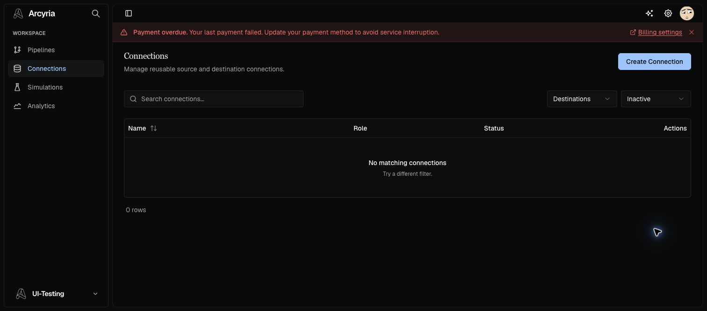

# Non-pipeline UI audit — 2026-09-05

## Scope

- Browser: Google Chrome controlled through the ChatGPT Chrome extension
- Session: existing authenticated local development session
- Coverage: 65 static non-pipeline routes, representative and invalid dynamic routes, searches, filters, sorting, pagination, tabs, create/edit forms, action menus, empty/error/loading states, native validation, and confirmation/dirty-form guards
- Excluded: pipeline feature testing, Playwright, test suites, final destructive actions, external OAuth authorization, real invitations, and credential-backed connection creation

## Result

All swept routes rendered, produced a deliberate disabled/not-found state, or intentionally redirected. The following reproducible UI issues were corrected and rechecked in Chrome:

1. Onboarding completion entered a React maximum-update loop.
2. Connection status filters were dropped by the legacy client and backend connection status was not exposed to the UI mapper.
3. A filtered zero-result connection list incorrectly opened the connector catalog.
4. Failed connection tests emitted duplicate error toasts.
5. Filtered team-member results used the unfiltered empty-state message.
6. Filtered workspace results used the unfiltered empty-state message.
7. Filtered activity-log results used the unfiltered empty-state message.
8. AI analytics reported a 100% success rate when the selected period contained zero runs.
9. Zero-run pipelines appeared in period-scoped run-frequency and top-pipeline analytics.
10. A delayed billing confirmation incorrectly changed to “Plan activated!” after timing out.
11. Legacy organization create/edit redirects dropped their action query parameters.
12. Connection details used nested link/button controls and an unnamed back action.
13. Clearing the inline connection name and pressing Enter silently retained the old name while reporting success.
14. Connector catalog search/clear, connection and team row actions, shared table search, the analytics pipeline selector, and SQL Explorer controls lacked accessible names.
15. An invalid connection ID stayed on a loading skeleton indefinitely.
16. Completed users could directly enter the retired mock connector-onboarding flow.
17. The global workspace search combobox had no accessible name.
18. The generated workspace URL field attached its label to a wrapper instead of the input.
19. Agent detail routes conflated loading, disabled/error, and missing-record states; simulation and coordinated-plan routes displayed arbitrary IDs as records.
20. Invalid team-member edit routes stayed on a loading form indefinitely.
21. Invalid dataset IDs opened an empty editable dataset form.
22. Failed simulation-run loads continued rendering loading tables and reconnecting an event stream.
23. Specialist Agent workspaces were publicly reachable even though the product surface is chat-only; every non-thread `/agents/*` route now redirects to the root chat, the Settings directory was removed, and specialist server capabilities were disabled.

Fresh browser-console check after the final fixes: no errors or warnings. The production build, full Biome lint (918 files), TypeScript type-check, Go build, and frontend file-size audit all passed.

## Interaction coverage

- Global search: result navigation, clear, Escape, and no-match state
- Connections: local search, role/status combinations, sorting, source view, schema search/no-match restoration, create validation, successful live connection test, inline-name validation, edit view, action menu, invalid-ID state, and delete confirmation/cancel
- Connector catalog: search, categories, source/destination role switching, and no-match state
- Team: search, status/role filters, invite validation, dirty-form confirmation, and owner-protected actions
- Workspaces/settings: all settings tabs, workspace search, create/edit forms, generated slug, reset/save states, and dirty-form confirmation
- Activity: workspace and AI-agent tabs, search, entity filters, sorting/pagination controls, and no-match states
- Simulations: runs, scenarios, and saved-test views, table/search controls, and invalid-run error behavior
- Agent chat surface: root chat, chat-history search, saved UUID thread navigation, specialist-route redirects, and removal of the Settings route directory
- Authentication/onboarding routes: signed-in redirects, invitation/error states, importing screen, completion redirect, and completed-user legacy-route guards

## Safety boundaries

Create/update/delete UI paths were exercised through validation, generated-value, dirty-form, protected-action, and confirmation boundaries. Draft workspace and notification changes were discarded. Final delete, real invite, OAuth reconnect, billing action, and credential-backed connection creation were intentionally not committed so shared development data, billing, and external accounts were not changed.

## Static verification

- Frontend lint: passed (`Checked 918 files`)
- TypeScript: passed (`tsc --noEmit`)
- Production build: passed (83 static pages generated)
- Go server build: passed (`go build ./...`)
- Maintained frontend source files over 500 lines: none
- Largest maintained frontend files: 500 lines
- Internal raw-anchor audit: no internal `<a href="/...">` matches
- Empty catch-block audit: no matches

## Evidence

